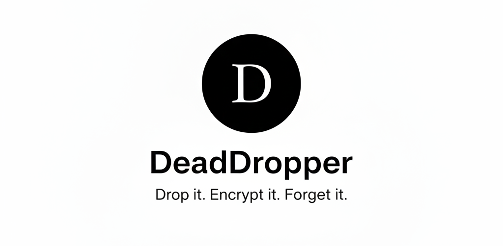

# DeadDropper


[](https://deaddropper.web.app)

**"Drop it. Encrypt it. Forget it."**

DeadDropper is a cutting-edge, zero-knowledge, end-to-end encrypted file sharing service designed for ultimate privacy and security. It allows users to securely share files without the need for accounts, ensuring complete anonymity and data protection. This repository showcases the project's architecture, security implementations, and the underlying "nerd-related" details that make it robust.

---

## 🚀 **Live Demo**

Experience DeadDropper live: [https://deaddropper.web.app](https://deaddropper.web.app)

---

## 🎯 **Project Overview**

DeadDropper is built on the principle of "zero-knowledge," meaning the service itself never has access to the unencrypted content of your files. All encryption and decryption happen client-side, ensuring that only the sender and the intended recipient can ever view the data. Files are stored temporarily and automatically "burned" (deleted) after a set schedule, reinforcing the "forget it" aspect of its tagline.

### **Key Features:**

- **End-to-End Encryption:** All files are encrypted in the browser before upload and decrypted in the browser upon download.
- **Zero-Knowledge Architecture:** DeadDropper servers never see your unencrypted data.
- **Anonymous File Sharing:** No user accounts, no personal data collection.
- **Self-Destructing Files:** Files are automatically deleted after a configurable time.
- **Multiple File Support:** Upload up to 5 files, automatically zipped client-side for convenience.
- **Large File Support:** Up to 5GB total transfer size.

---

## 🏗️ **System Architecture (Nerd Details)**

DeadDropper employs a robust, serverless architecture leveraging AWS services for scalability, reliability, and security.

### **Frontend Architecture:**

- **Framework**: React 18 with TypeScript
- **Build Tool**: Vite
- **Styling**: Tailwind CSS with shadcn/ui components
- **State Management**: React hooks
- **Routing**: React Router v6
- **Encryption Library**: Custom `EncryptionUtils` for AES-256 GCM encryption, leveraging Web Crypto API.
- **File Handling**: `jszip` for client-side ZIP creation for multiple files.

### **Backend Architecture (AWS Serverless):**

The backend is entirely serverless, primarily using AWS Lambda functions and S3 for storage.

- **AWS Lambda Functions (Python):**
  - `create_drop.py`: Handles the initial request to create a "drop." It generates a unique drop code, stores metadata (encrypted manifest), and prepares for file upload.
  - `presign_upload.py`: Generates a pre-signed S3 URL, allowing the client to directly upload the encrypted file to S3 without routing through the DeadDropper backend. This is a critical security and performance feature.
  - `get_drpp.py`: Retrieves the encrypted manifest and file metadata for a given drop code, enabling the recipient to initiate download.
  - `burn_drop.py`: Initiates the deletion process for a drop. This can be triggered manually or by the `deletion_worker`.
  - `pickup_attempt.py`: Logs pickup attempts, potentially used for analytics or rate limiting (though not fully implemented for rate limiting in this version).
  - `deletion_worker.py`: A scheduled Lambda function (e.g., via CloudWatch Events) that periodically checks for expired drops and triggers `burn_drop` for them.
- **AWS S3 (Simple Storage Service):**
  - **Encrypted File Storage:** Stores the actual encrypted file blobs. S3's server-side encryption (SSE-S3) is used in addition to client-side encryption, providing defense-in-depth.
  - **Manifest Storage:** Stores encrypted metadata (manifests) about each drop.
- **AWS DynamoDB:**
  - Used for storing drop metadata (e.g., drop code, S3 key, burn schedule, encryption key ID). This data is minimal and carefully managed to maintain the zero-knowledge principle.
- **AWS API Gateway:**
  - Provides the RESTful API endpoints for the frontend to interact with the Lambda functions.
- **AWS CloudFront:**
  - Content Delivery Network (CDN) for serving the frontend application, ensuring fast global access.

---

## 🔒 **Security Standards & Implementation**

DeadDropper's core value is security and privacy. Here's how it's achieved:

1. **End-to-End Encryption (E2EE):**
   - **Algorithm:** AES-256 GCM (Galois/Counter Mode) is used for symmetric encryption. This is a strong, authenticated encryption algorithm that provides both confidentiality and integrity.
   - **Key Derivation:** A unique, cryptographically strong symmetric key is generated client-side for each file. This key is never sent to the server.
   - **Key Wrapping:** The symmetric file key is then encrypted using a passphrase provided by the user (or a randomly generated one if none is provided). This wrapped key is part of the encrypted manifest.
   - **Web Crypto API:** All cryptographic operations are performed using the browser's native Web Crypto API, which is highly optimized and secure.

2. **Zero-Knowledge Principle:**
   - **Client-Side Encryption:** Files are encrypted *before* leaving the user's browser. The server only receives encrypted blobs.
   - **No Server-Side Decryption:** The backend has no mechanism or keys to decrypt user files.
   - **Encrypted Metadata:** Even file metadata (like original filename, size) is part of an encrypted manifest, further protecting user privacy.

3. **Secure File Uploads (Pre-signed URLs):**
   - The frontend requests a pre-signed S3 URL from the `presign_upload` Lambda.
   - This URL grants temporary, limited-privilege access to a specific S3 bucket location.
   - The client then uploads the encrypted file directly to S3, bypassing the DeadDropper backend entirely for the large file transfer. This reduces server load and potential attack surface.

4. **Ephemeral Storage & Automatic Deletion:**
   - Files are designed to be temporary. Each drop has a burn schedule (e.g., 24 hours).
   - The `deletion_worker` Lambda ensures that expired files are permanently removed from S3 and their metadata from DynamoDB.
   - The `burn_drop` Lambda can also be triggered manually by the sender or after a successful pickup (optional, depending on configuration).

5. **No User Accounts / Anonymity:**
   - By not requiring user accounts, DeadDropper avoids collecting personally identifiable information (PII), enhancing user anonymity and reducing the risk of data breaches related to user profiles.

6. **Input Validation & Error Handling:**
   - Robust client-side and server-side validation prevents malicious inputs and ensures data integrity.
   - Error handling is implemented across the system to gracefully manage unexpected situations.

7. **Dependency Management:**
   - Dependencies are carefully managed and kept up-to-date to mitigate known vulnerabilities.

---

## 🛠️ **Development & Contribution**

This project is developed by [Anand](https://github.com/PanotiProgrammer) and is part of the PN Projects initiative.

### **Developer:**
- **Anand** - [@PanotiProgrammer](https://github.com/PanotiProgrammer)

### **Maintainer & Contributor:**
- **PanotiProgrammer** - [github.com/PanotiProgrammer](https://github.com/PanotiProgrammer)

Feel free to explore the codebase, report issues, or suggest improvements.

---

## 📦 **Installation & Setup**

### **Prerequisites:**
- Node.js (v18 or higher)
- npm or yarn
- AWS CLI (for backend deployment)

### **Frontend Setup:**

```bash
# Clone the repository
git clone https://github.com/PN-Projects/DeadDropper.git
cd DeadDropper

# Install dependencies
npm install

# Start development server
npm run dev
```

### **Backend Setup (AWS Lambda):**

```bash
# Install AWS CLI and configure credentials
aws configure

# Deploy Lambda functions (requires AWS CLI and proper permissions)
# Each Lambda function can be deployed individually using AWS CLI or AWS Console
```

---

## 🧪 **Testing**

```bash
# Run linting
npm run lint

# Build for production
npm run build

# Preview production build
npm run preview
```

---

## 📊 **Performance & Scalability**

- **Serverless Architecture:** Auto-scaling based on demand
- **CDN Distribution:** Global content delivery via CloudFront
- **Chunked Uploads:** Efficient handling of large files
- **Memory Management:** Optimized for large file processing
- **Database Optimization:** DynamoDB for high-performance metadata storage

---

## 🔧 **API Endpoints**

- `POST /api/presign` - Generate presigned URLs for upload
- `POST /api/drops` - Create a new drop and get 6-digit code
- `GET /api/short/:code` - Resolve short code to drop ID
- `GET /api/drops/:id` - Retrieve drop metadata and manifest
- `POST /api/drops/:id/pickup` - Log pickup attempt
- `POST /api/drops/:id/burn` - Burn a drop (auto-triggered after download)

---

## 📜 **License**

This project is open-source and available under the [MIT License](LICENSE).

---

## 🤝 **Contributing**

We welcome contributions! Please feel free to submit a Pull Request. For major changes, please open an issue first to discuss what you would like to change.

1. Fork the repository
2. Create your feature branch (`git checkout -b feature/AmazingFeature`)
3. Commit your changes (`git commit -m 'Add some AmazingFeature'`)
4. Push to the branch (`git push origin feature/AmazingFeature`)
5. Open a Pull Request

---

## 📞 **Support**

If you have any questions or need help, please open an issue or contact [@PanotiProgrammer](https://github.com/PanotiProgrammer).

---

## 🌟 **Acknowledgments**

- Built with ❤️ by [Anand](https://github.com/PanotiProgrammer)
- Part of the PN Projects initiative
- Inspired by the need for truly private file sharing

---


**Privacy is not a feature. It's a fundamental right.**


